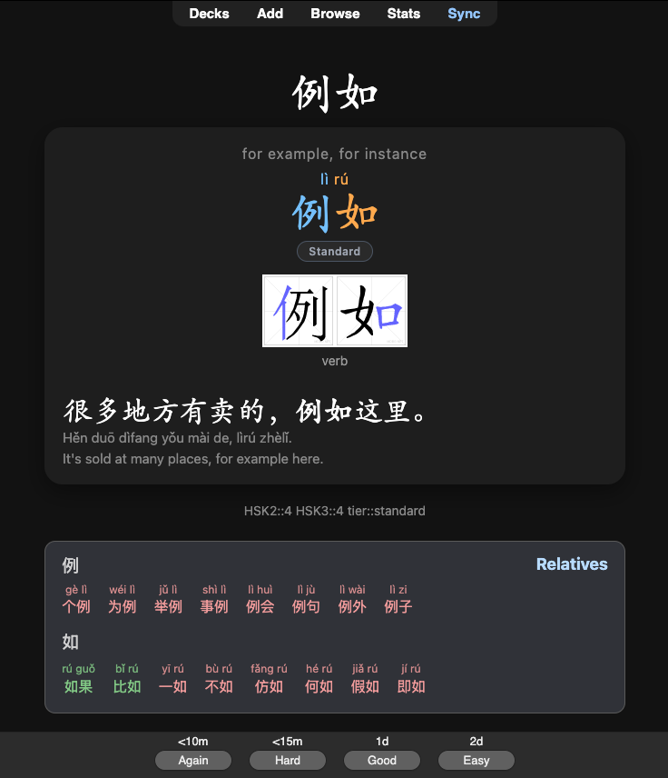
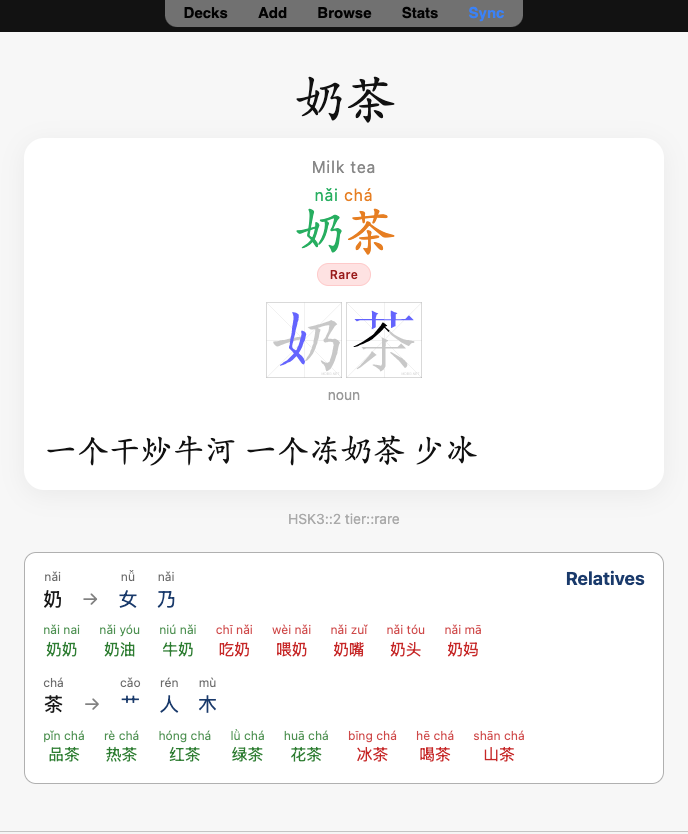
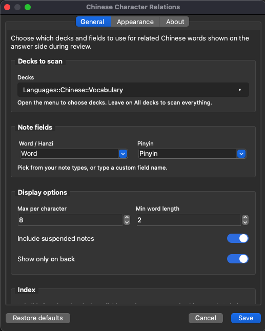
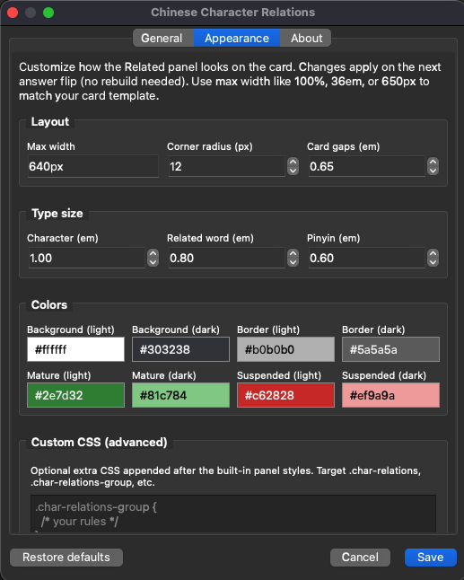

# Chinese Character Relations

Anki desktop add-on that shows **related words from your own deck** that share Chinese characters with the card you’re reviewing.

Example: reviewing **好** → under the answer you see 好像, 好的, 好听…  
Reviewing **好像** → groups by 好 and 像 (the current word is excluded).

Works offline. Uses only your collection — no external dictionary, no AnkiConnect.

## Screenshots

<table>
  <tr>
    <td align="center" width="50%">
      
<strong>Dark mode</strong>

      
    </td>
    <td align="center" width="50%">
      
<strong>Light mode</strong>

      
    </td>
  </tr>
  <tr>
    <td align="center" width="50%">
      
<strong>Settings — General</strong>

      
    </td>
    <td align="center" width="50%">
      
<strong>Settings — Appearance</strong>

      
    </td>
  </tr>
</table>

## Requirements

- Anki Desktop **23.10+** (Qt6 preferred)
- macOS, Windows, or Linux

## Install

### From GitHub (recommended until AnkiWeb is live)

1. Open the latest [Release](https://github.com/sageozzeus/Chinese-Character-Relations/releases/latest).
2. Download the **`.ankiaddon`** asset (e.g. `chinese_char_relations-0.1.0.ankiaddon`), not Source code.
3. Double-click the file, or open it with Anki / drag it onto the Anki window.
4. Restart Anki when prompted.
5. Open **Tools → Character Relations…**
6. On the **General** tab, set your Word / Hanzi (and optional Pinyin) fields, then click **Rebuild Index**.

### From AnkiWeb

When the listing is live: **Tools → Add-ons → Get Add-ons…**, search for *Chinese Character Relations*, or open the listing from the About tab after install.

### Manual (developers)

Copy the `chinese_char_relations` folder into your Anki add-ons folder, then restart Anki:

- **macOS:** `~/Library/Application Support/Anki2/addons21/`
- **Windows:** `%APPDATA%\Anki2\addons21\`
- **Linux:** `~/.local/share/Anki2/addons21/`

## Settings

**Tools → Character Relations…** (or **Tools → Add-ons → Config**):

| Tab | What it’s for |
| --- | --- |
| **General** | Decks, field names, display limits, **Rebuild Index** |
| **Appearance** | Panel width, type sizes, colors, optional custom CSS |
| **About** | Version, changelog, bug reports, links |

After changing decks or fields, rebuild when prompted (or use **Rebuild Index**). Appearance changes apply on the next answer flip — no rebuild needed.

Defaults assume a `Word` and `Pinyin` field. If your deck uses `Hanzi` / `Expression` / etc., set those names on the General tab.

## Tips

- Click a related word to open that note in the Browser.
- If nothing related appears, check field names and rebuild; rare characters with no other deck words simply show no panel.
- Suspended notes can be included or hidden on the General tab.

## Support

- **Bugs:** [GitHub Issues](https://github.com/sageozzeus/Chinese-Character-Relations/issues)
- **Updates / short questions:** [X @sageozzeus](https://x.com/sageozzeus)
- **Source:** [github.com/sageozzeus/Chinese-Character-Relations](https://github.com/sageozzeus/Chinese-Character-Relations)

Maintainer docs (dev setup, architecture, packaging): [`docs/MAINTENANCE.md`](docs/MAINTENANCE.md) · QA checklist: [`docs/TESTING.md`](docs/TESTING.md)

## License

MIT — see [`LICENSE`](LICENSE).
